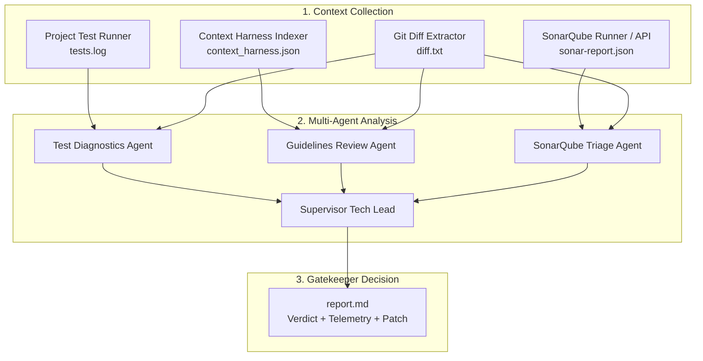

# Universal AI Gatekeeper Reviewer Skill

The `ai-gatekeeper-reviewer` skill coordinates the complete automated code review lifecycle. It enforces architectural guidelines (Context Harness), correlates test failures with git diffs, triages SonarQube static analysis issues, and renders an executive Tech Lead verdict (`APPROVED` / `REJECTED`) with LLMOps telemetry.

---

## Cross-Agent Compatibility

This skill is designed for seamless operation across the modern AI coding assistant ecosystem:

Agent | Invocation Mechanism | Configuration File
:--- | :--- | :---
**Google Antigravity (AGY)** | Skill discovery in `.agents/skills/ai-gatekeeper-reviewer` | `AGENTS.md` / `GEMINI.md`
**GitHub Copilot** | Workspace review prompt / custom instructions | `.github/copilot-instructions.md`
**Claude Code** | CLI prompt or subagent command execution | `CLAUDE.md`
**OpenAI GPT / Cursor** | Agent review mode or terminal command | `.cursorrules` / `AGENTS.md`

---

## Review Pipeline Overview



---

## Execution Instructions for Agents

When requested to review a branch, PR, or local staging area:

### One-Command Automated Execution (Recommended)
Run the master orchestration script from the repository:

```bash
bash .agents/skills/ai-gatekeeper-reviewer/scripts/run_review.sh --target .
```

To review an external target project (e.g., from a central review workspace):
```bash
bash .agents/skills/ai-gatekeeper-reviewer/scripts/run_review.sh --target /path/to/target/project
```

To automatically apply remediation patches generated by the supervisor:
```bash
bash .agents/skills/ai-gatekeeper-reviewer/scripts/run_review.sh --target . --apply-patch
```

### Step-by-Step Manual Procedure

If the agent needs granular control over each phase:

1. **Build or Refresh the Context Harness**:
   ```bash
   python docs/gatekeeper/build_harness.py --docs <target>/docs <target>/README.md --output <target>/context_harness.json
   ```

2. **Run the Target Project's Tests**:
   Execute the project-specific test command and capture output into `tests.log`:
   - Node / React / TypeScript: `npm test > tests.log 2>&1 || true`
   - Python: `pytest > tests.log 2>&1 || true`
   - Go: `go test ./... > tests.log 2>&1 || true`

3. **Fetch or Scan SonarQube Issues**:
   ```bash
   bash .agents/skills/sonarqube-runner/scripts/run_sonar.sh --target <target> --api
   ```

4. **Extract the Active Diff**:
   - For staged/unstaged working changes: `git diff HEAD > diff.txt`
   - For feature branches: `git diff origin/main...HEAD > diff.txt`

5. **Run the LangGraph Gatekeeper**:
   ```bash
   python docs/gatekeeper/gatekeeper.py --target <target>
   ```

6. **Inspect the Verdict**:
   Read `<target>/report.md`. If the supervisor marked the verdict as `REJECTED`:
   - Identify the BLOCKER violations listed in the report.
   - Propose or apply exact code remediations.
   - Re-run the review until an `APPROVED` verdict is achieved.
