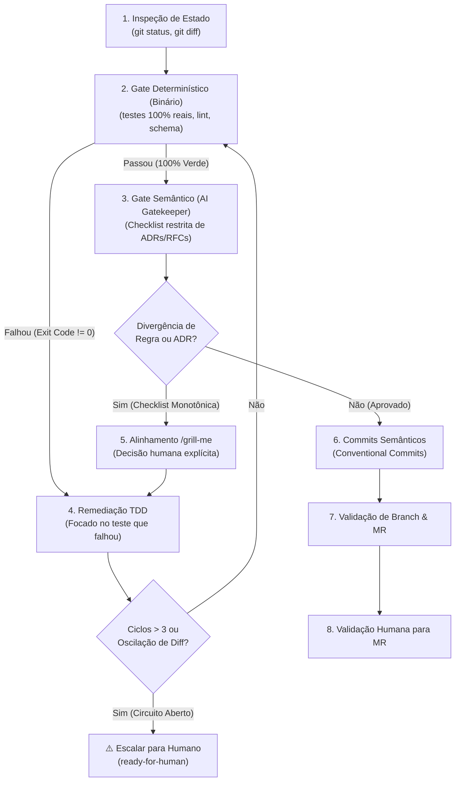

# Git Flow: Pre-Commit & Pre-MR Quality Gate

A skill `git-flow` é o pipeline de controle de qualidade mandatório que valida o trabalho de desenvolvimento na branch do membro antes do commit e da abertura de Merge Request no GitLab.

Opera como um **loop de feedback seguro e determinístico** com Circuit Breaker e verificações monotônicas para evitar loops infinitos de agentes.



---

## Política de Branches e Merge Requests Obrigatórios

O repositório adota a estrutura hierárquica estrita:

1. **`main`**: Produção / releases finais entregues. **Protegida contra push direto**.
2. **`dev`**: Branch de integração contínua e desenvolvimento ativo da equipe. **Protegida contra push direto**.
3. **`member/<slug>`**: Branch pessoal de cada integrante (originada de `dev`).

### Fluxo de MRs
- **MR Obrigatório de Feature**: `member/<slug>` $\rightarrow$ `dev`
  - Toda funcionalidade desenvolvida deve obrigatoriamente passar por este MR após a aprovação de todos os gates do `git-flow`.
  - **Exige no mínimo 2 aprovações de integrantes** antes do merge.
- **MR Obrigatório de Release**: `dev` $\rightarrow$ `main`
  - A consolidação de entregas e versões para a branch principal é feita exclusivamente via MR a partir de `dev`.
  - **Exige no mínimo 2 aprovações de integrantes** antes do merge.
- **Pushes diretos para `dev` ou `main` são estritamente proibidos.**

---

## Travas Determinísticas contra Loops Infinitos

1. **Circuit Breaker (`MAX_CYCLES = 3`)**: O ciclo de remediação só pode rodar no máximo 3 vezes. Se na 3ª rodada ainda houver pendências, o pipeline desarma e escala para `ready-for-human`.
2. **Bifurcação de Gates**:
   - **Gate Determinístico (Binário)**: Testes de integração reais e linters rodam primeiro. Não há subjetividade de LLM: exit code `0` ou `1`.
   - **Gate Semântico (AI Gatekeeper)**: Só roda quando os testes estão 100% verdes. Avalia estritamente a conformidade com as ADRs e RFCs.
3. **Checklist Monotônica (Anti-Moving Goalposts)**: No primeiro ciclo, o Gatekeeper emite uma lista fechada de pendências. Em ciclos subsequentes, o agente só atua para fechar itens abertos; novas sugestões de estilo ou refatorações subjetivas são proibidas.
4. **Detecção de Oscilação (Diff Hashing)**: Se uma alteração reverter o código do ciclo anterior ou repetir um estado de diff, o agente interrompe o loop imediatamente.
5. **Decisão Humana Obrigatória (`/grill-me`)**: Ambiguidade de especificação ou regras de negócio conflitantes nunca são "adivinhadas" pelo agente; requerem alinhamento interativo via `/grill-me`.

---

## Procedimento de Execução

### Passo 1: Inspeção de Estado e Diff
1. Inspecione o estado atual do repositório:
   ```bash
   git status -s
   git diff
   ```
2. Mapeie os arquivos modificados e as RFCs/ADRs envolvidas.
3. Confirme que você está trabalhando na sua branch de membro (`member/<nome>`).

### Passo 2: Gate Determinístico (Testes e Schema)
1. Execute a suíte de testes de integração e E2E:
   - Node / TypeScript: `npm test`
   - Python: `pytest tests/`
2. Se qualquer teste falhar, vá diretamente para o **Passo 4 (TDD)** sem acionar o Gatekeeper Semântico.

### Passo 3: Gate Semântico (AI Gatekeeper)
1. Com os testes verdes, execute o revisor inteligente:
   ```bash
   bash .agents/skills/ai-gatekeeper-reviewer/scripts/run_review.sh --target .
   ```
2. O Gatekeeper valida a aderência estrita às diretrizes do projeto:
   - **[ADR 0001](file:///home/jpcalsavara/projetos/andamento/si600-web-petshop/docs/adr/0001-estrategia-de-testes-integracao-e-e2e.md)**: Apenas testes de integração e E2E reais nos seams públicos (zero mocks de banco ou serviços internos).
   - **[ADR 0002](file:///home/jpcalsavara/projetos/andamento/si600-web-petshop/docs/adr/0002-padroes-de-cenarios-de-teste-bons-ruins-incompletos.md)**: Cobertura tripartite obrigatória para cada fluxo (Casos Bons, Casos Ruins e Casos Incompletos com HTTP 400 e RFC 7807).
   - **[CONTEXT.md](file:///home/jpcalsavara/projetos/andamento/si600-web-petshop/CONTEXT.md)**: Vocabulário ubíquo (`Cliente`, `Pet`, `Servico`, `Profissional`, `Agendamento`) e invariantes de negócio.
3. Se o veredito for `REJECTED`, emita uma **Checklist Fechada** e proceda para o Passo 4.

### Passo 4: Remediação com `/tdd`
1. Aplique o ciclo **`/tdd`** (Red $\rightarrow$ Green) focado exclusivamente na falha detectada.
2. Verifique o contador de ciclos (`ciclo <= 3`) e a ausência de oscilação de diff.

### Passo 5: Alinhamento via `/grill-me` (Se Houver Inconsistência de Negócio)
1. Se a não-conformidade envolver ambiguidade entre RFCs, regras de domínio ou conflitos de modelo:
   - Acione a dinâmica de **`/grill-me`** para obter a decisão explícita do desenvolvedor.

### Passo 6: Geração de Commits Semânticos
Com 100% de aprovação nos dois gates:
1. Agrupe as mudanças logicamente usando **Conventional Commits**:
   - `docs(rfc):`: Adição ou atualização de RFCs e documentação técnica.
   - `feat(...)`: Novas funcionalidades, rotas ou modelos de domínio.
   - `test(...)`: Novos testes de integração/E2E cobrindo casos tripartite.
   - `fix(...)`: Correções de bugs ou alinhamentos de schema.
2. Execute os commits locais.

### Passo 7: Validação e Abertura do Merge Request
1. Apresente um resumo executivo das mudanças prontas para envio:
   - Branch de trabalho (`member/<nome>`) e branch de destino (`dev`).
   - Lista de commits gerados.
   - Status final dos testes de integração (100% verdes).
   - Veredito do AI Gatekeeper (`APPROVED`).
2. Solicite expressamente a **autorização do usuário** para realizar o `git push` e abrir o MR:
   ```bash
   glab mr create --source member/<nome> --target dev --title "feat: <título>" --description "<resumo>"
   ```
