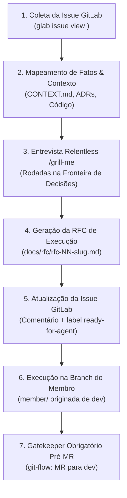

# Skill: Refinamento de Issues com Grill-me e Modelo RFC

A skill `refine-issue` conduz o refinamento aprofundado de uma demanda (issue do GitLab), eliminando ambiguidades por meio de uma entrevista técnica implacável (`/grill-me`) e gerando um documento base formal (`docs/rfc/rfc-<NN>-<slug>.md`) baseado no [rfc-modelo.md](file:///home/jpcalsavara/projetos/andamento/si600-web-petshop/docs/rfc/rfc-modelo.md), pronto para execução via TDD e validação pré-MR pelo [git-flow](file:///home/jpcalsavara/projetos/andamento/si600-web-petshop/.agents/skills/git-flow/SKILL.md).



---

## Procedimento Passo a Passo

### Passo 1: Obtenção da Issue no GitLab

1. Solicite ou receba o identificador da issue (ex: `#12`, `12` ou URL).
2. Obtenha os detalhes da issue e o histórico de discussão:
   ```bash
   glab issue view <id> --comments
   ```
   *Caso a CLI `glab` não esteja autenticada no ambiente, solicite que o usuário forneça o conteúdo da issue ou configure `glab auth login --hostname gitlab.unicamp.br`.*
3. Extraia o escopo proposto, critérios de aceite preliminares e restrições.

### Passo 2: Investigação Autônoma de Fatos (Agent's Job)

Antes de questionar o usuário, o agente deve investigar o repositório por conta própria:
1. **Vocabulário de Domínio**: Consulte [CONTEXT.md](file:///home/jpcalsavara/projetos/andamento/si600-web-petshop/CONTEXT.md) para garantir termos ubíquos (`Cliente`, `Pet`, `Servico`, `Profissional`, `Agendamento`, etc.).
2. **Decisões Arquiteturais**: Revise [ADR 0001](file:///home/jpcalsavara/projetos/andamento/si600-web-petshop/docs/adr/0001-estrategia-de-testes-integracao-e-e2e.md) (apenas testes de integração/E2E reais) e [ADR 0002](file:///home/jpcalsavara/projetos/andamento/si600-web-petshop/docs/adr/0002-padroes-de-cenarios-de-teste-bons-ruins-incompletos.md) (cenários tripartite: bons, ruins, incompletos).
3. **Seams Existentes**: Verifique se já existem rotas, modelos de banco ou middlewares relacionados à demanda.
4. *Nunca pergunte ao usuário nada que possa ser inspecionado diretamente no código ou na documentação.*

### Passo 3: Entrevista Relentless (`/grill-me`)

Conduza a entrevista técnica seguindo o modelo do **`grilling`**:
1. Trabalhe em **rodadas**. A fronteira é composta pelas decisões cujos pré-requisitos já foram esclarecidos.
2. Cada pergunta deve ser formatada estritamente com título, contexto/opções e uma resposta recomendada:
   ```
   ❓ **Q<N>** - **<Título da Decisão>**: <Contexto, opções ou implicações>

   ➡️ <Sua recomendação técnica fundamentada no domínio e ADRs>
   ```
3. A entrevista deve cobrir obrigatoriamente:
   - **Dor Real & Escopo**: Quem é o usuário impactado (tutor ou equipe interna) e o que está fora de escopo.
   - **No mínimo 3 Alternativas Descartadas**: Abordagens técnicas ou de produto que foram cogitadas, justificando o porquê do descarte e trade-offs.
   - **As Seis Perguntas Obrigatórias do Fluxo**:
     1. Qual é o endpoint e método HTTP?
     2. Quais validações e buscas no banco de dados ocorrem?
     3. Quais são todos os desvios de erro e códigos HTTP (`400`, `403`, `404`, `409`, `422`) via RFC 7807?
     4. O que é persistido no banco e qual o estado resultante?
     5. Qual o DTO de resposta formatado?
     6. Qual o status HTTP de sucesso retornado (`200` ou `201`)?
   - **Matriz Tripartite de Testes (ADR 0002)**: Casos Bons, Casos Ruins (com garantia de zero escrita suja) e Casos Incompletos (payloads vazios/nulos com erro 400).
   - **Principal Desafio Técnico**: Condições de corrida, locks, concorrência de agendamentos no mesmo horário.

### Passo 4: Geração da RFC de Execução

Após a confirmação e encerramento da fronteira de perguntas:
1. Crie o arquivo `docs/rfc/rfc-<NN>-<slug>.md` utilizando a estrutura do [docs/rfc/rfc-modelo.md](file:///home/jpcalsavara/projetos/andamento/si600-web-petshop/docs/rfc/rfc-modelo.md).
2. Preencha integralmente todas as seções obrigatórias:
   - Metadados (`Status: Em Refinamento` ou `Aprovada`, Autor, Data, Versão).
   - Contextualização (Entendendo o problema, Solução macro, Alternativas descartadas).
   - Implementação (Diretriz ADR 0001/0002, Tabela de Rotas, Diagrama ER Mermaid, Diagrama de Fluxo Mermaid respondendo às 6 perguntas, Fluxos textuais tripartite).
   - Principal Desafio.

### Passo 5: Registro no Issue Tracker do GitLab

1. Publique um comentário na issue vinculando o documento base:
   ```bash
   glab issue note <id> --message "Refinamento concluído. RFC gerada: docs/rfc/rfc-<NN>-<slug>.md"
   ```
2. Atualize os labels da issue para indicar que está pronta para implementação:
   ```bash
   glab issue update <id> --label "ready-for-agent"
   ```

### Passo 6: Passagem para Execução & Padrão Pré-MR (`git-flow`)

O documento de RFC torna-se o contrato executável para implementação:
1. **Branch de Trabalho**:
   - O desenvolvimento deve ocorrer na branch dedicada do integrante:
     ```bash
     git checkout dev
     git pull origin dev
     git checkout member/<slug>
     git merge dev
     ```
2. **Ciclo TDD**:
   - Implementação dos testes de integração primeiro nos seams públicos (cobrindo a matriz tripartite).
   - Implementação do código até que todos os testes passem (Red $\rightarrow$ Green).
3. **Padrão Pré-MR (`git-flow`)**:
   - Antes de abrir qualquer Merge Request, o agente/desenvolvedor deve executar rigorosamente o pipeline [git-flow](file:///home/jpcalsavara/projetos/andamento/si600-web-petshop/.agents/skills/git-flow/SKILL.md):
     - Inspeção de diff.
     - Gate determinístico: 100% dos testes de integração passando.
     - Gate semântico: `bash .agents/skills/ai-gatekeeper-reviewer/scripts/run_review.sh --target .` com veredito `APPROVED`.
     - Commits semânticos no padrão Conventional Commits.
4. **Abertura do Merge Request Obrigatório**:
   - Apenas com a aprovação explícita do desenvolvedor:
     ```bash
     glab mr create --source member/<slug> --target dev --title "feat(<escopo>): <título da issue>" --description "Ref: #<id>\nRFC: docs/rfc/rfc-<NN>-<slug>.md"
     ```
