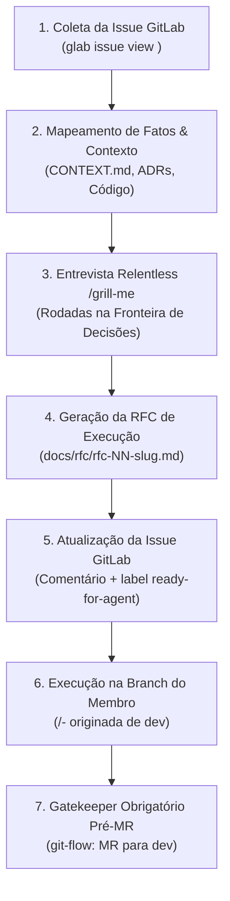

# Skill: Refinamento de Issues com Grill-me e Modelo RFC

A skill `refine-issue` conduz o refinamento aprofundado de uma demanda (issue do GitLab), eliminando ambiguidades por meio de uma entrevista técnica implacável (`/grill-me`) e gerando um documento base formal (`docs/rfc/rfc-<NN>-<slug>.md`) baseado no [rfc-modelo.md](file:///home/jpcalsavara/projetos/andamento/si600-web-eventos/docs/rfc/rfc-modelo.md), pronto para execução via TDD e validação pré-MR pelo [git-flow](file:///home/jpcalsavara/projetos/andamento/si600-web-eventos/.agents/skills/git-flow/SKILL.md).


```mermaid
flowchart TD
    A["1. Coleta da Issue GitLab\n(glab issue view <id>)"] --> B["2. Mapeamento de Fatos & Contexto\n(CONTEXT.md, ADRs, Código)"]
    B --> C["3. Entrevista Relentless /grill-me\n(Rodadas na Fronteira de Decisões)"]
    C --> D["4. Geração da RFC de Execução\n(docs/rfc/rfc-NN-slug.md)"]
    D --> E["5. Atualização da Issue GitLab\n(Comentário + label ready-for-agent)"]
    E --> F["6. Execução na Branch do Membro\n(<tipo>/<ID-da-issue>-<titulo> originada de dev)"]
    F --> G["7. Gatekeeper Obrigatório Pré-MR\n(git-flow: MR para dev)"]
```

---

## Procedimento Passo a Passo

### Passo 1: Obtenção da Issue no GitLab

1. Solicite ou receba o identificador da issue (ex: `#12`, `12` ou URL).
2. Obtenha os detalhes da issue e o histórico de discussão:
   ```bash
   glab issue view <id> --comments
   ```
   *Caso a CLI `glab` não esteja autenticada no ambiente, solicite que o usuário forneça o conteúdo da issue ou configure `glab auth login --hostname gitlab.unicamp.br`.*
3. Extraia o escopo proposto, critérios de aceite preliminares e restrições.

### Passo 2: Investigação Autônoma de Fatos (Agent's Job)

Antes de questionar o usuário, o agente deve investigar o repositório por conta própria:
1. **Vocabulário de Domínio**: Consulte [CONTEXT.md](file:///home/jpcalsavara/projetos/andamento/si600-web-eventos/CONTEXT.md) para garantir termos ubíquos (`Cliente`, `Pet`, `Servico`, `Profissional`, `Agendamento`, etc.).
2. **Decisões Arquiteturais**: Revise [ADR 0001](file:///home/jpcalsavara/projetos/andamento/si600-web-eventos/docs/adr/0001-estrategia-de-testes-integracao-e-e2e.md) (apenas testes de integração/E2E reais) e [ADR 0002](file:///home/jpcalsavara/projetos/andamento/si600-web-eventos/docs/adr/0002-padroes-de-cenarios-de-teste-bons-ruins-incompletos.md) (cenários tripartite: bons, ruins, incompletos).
3. **Seams Existentes**: Verifique se já existem rotas, modelos de banco ou middlewares relacionados à demanda.
4. *Nunca pergunte ao usuário nada que possa ser inspecionado diretamente no código ou na documentação.*

### Passo 3: Entrevista Relentless (`/grill-me`)
Conduza a entrevista técnica com o usuário para fechar o escopo de negócio e regras limítrofes:
1. Trabalhe em **rodadas**. Questione ambiguidades, tratamento de erros, escopo exato do usuário afetado e restrições.
2. Cada pergunta deve sugerir uma resposta recomendada baseada no domínio.
3. Não avance para as especificações técnicas até que o cenário de negócio esteja 100% definido.

### Passo 4: Detalhamento Técnico (`/to-spec`)
Com o negócio fechado, inicie a fase de especificação técnica (o *Spec*):
1. **Contratos de Interface**: Defina os endpoints HTTP exatos, DTOs de entrada/saída e HTTP Status codes de sucesso (200/201) e erro (400, 403, 404, 422 - RFC 7807).
2. **Modelo de Dados**: Especifique as alterações em entidades (`@Entity`), colunas e tipagens de banco de dados.
3. **Matriz Tripartite**: Especifique os cenários de testes que serão exigidos (Happy Path, Sad Path, Boundary/Malformed).
4. **Dependências**: Liste se a tarefa precisa criar novas queries JPA ou consumir serviços de terceiros.

### Passo 5: Geração da RFC de Execução
Reúna os outputs do Passo 3 e Passo 4:
1. Crie o arquivo `docs/rfc/rfc-<NN>-<slug>.md` utilizando a estrutura do [docs/rfc/rfc-modelo.md](file:///home/jpcalsavara/projetos/andamento/si600-web-eventos/docs/rfc/rfc-modelo.md).
2. Preencha a RFC com a visão de negócio e a especificação técnica documentada.

### Passo 6: Fatiamento em Tarefas (`/to-ticket`)
O último passo é quebrar a implementação em passos sequenciais acionáveis (sub-cards):
1. Crie uma **Checklist de Execução**, dividindo o épico em pequenas tarefas (ex: `[ ] 1. Criar DTOs e Endpoint`, `[ ] 2. Implementar Repository`, `[ ] 3. Escrever Integração Tripartite`, `[ ] 4. Tela Frontend`).
2. Insira essa checklist de tarefas no final da RFC gerada para controle do desenvolvedor/agente no orquestrador `feature-builder`.

### Passo 7: Registro no Issue Tracker do GitLab

1. Publique um comentário na issue vinculando o documento base:
   ```bash
   glab issue note <id> --message "Refinamento concluído. RFC gerada: docs/rfc/rfc-<NN>-<slug>.md"
   ```
2. Atualize os labels da issue para indicar que está pronta para implementação:
   ```bash
   glab issue update <id> --label "ready-for-agent"
   ```

### Passo 8: Passagem para Execução & Padrão Pré-MR (`git-flow`)

O documento de RFC torna-se o contrato executável para implementação:
1. **Branch de Trabalho**:
   - O desenvolvimento deve ocorrer na branch dedicada do integrante:
     ```bash
     git checkout dev
     git pull origin dev
     git checkout <tipo>/<ID-da-issue>-<titulo>
     git merge dev
     ```
2. **Ciclo TDD**:
   - Implementação dos testes de integração primeiro nos seams públicos (cobrindo a matriz tripartite).
   - Implementação do código até que todos os testes passem (Red $\rightarrow$ Green).
3. **Padrão Pré-MR (`git-flow`)**:
   - Antes de abrir qualquer Merge Request, o agente/desenvolvedor deve executar rigorosamente o pipeline [git-flow](file:///home/jpcalsavara/projetos/andamento/si600-web-eventos/.agents/skills/git-flow/SKILL.md):
     - Inspeção de diff.
     - Gate determinístico: 100% dos testes de integração passando.
     - Gate semântico: `bash .agents/skills/ai-gatekeeper-reviewer/scripts/run_review.sh --target .` com veredito `APPROVED`.
     - Commits semânticos no padrão Conventional Commits.
4. **Abertura do Merge Request Obrigatório**:
   - Apenas com a aprovação explícita do desenvolvedor:
     ```bash
     glab mr create --source <tipo>/<ID-da-issue>-<titulo> --target dev --title "feat(<escopo>): <título da issue>" --description "Ref: #<id>\nRFC: docs/rfc/rfc-<NN>-<slug>.md"
     ```
