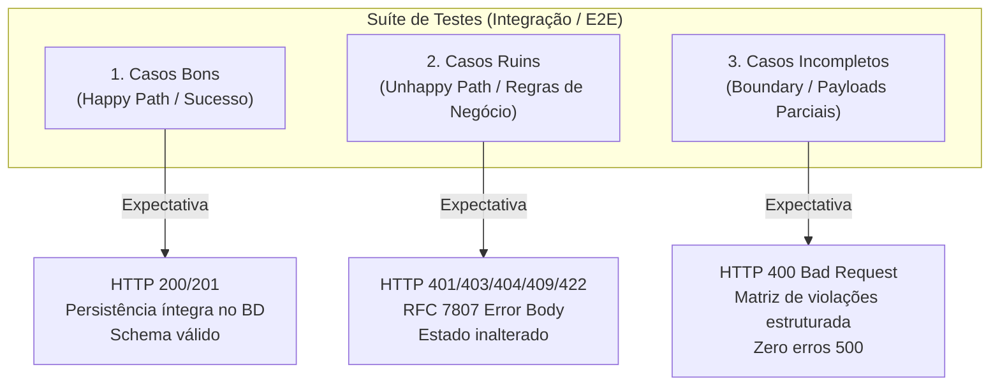

# ADR 0002: Padrão Tripartite de Cenários de Teste — Casos Bons, Casos Ruins e Casos Incompletos

## Status
Aceito (Accepted)

## Data
2026-09-23

## Contexto

Com a decisão estabelecida no [ADR 0001](0001-estrategia-de-testes-integracao-e-e2e.md) de focar exclusivamente em **Testes de Integração e E2E**, surge a necessidade crítica de definir a profundidade e a taxonomia dos cenários que devem compor cada suíte de testes.

Um dos erros mais frequentes na engenharia de software é a cobertura assimétrica: desenvolvedores tendem a cobrir quase que exclusivamente o "caminho feliz" (*happy path*), negligenciando erros de domínio e falhas de validação de borda. No contexto de um pet shop web:
- Falhas em **casos de negócio (ruins)** geram conflitos graves na vida real (ex: dois animais agendados na mesma mesa com o mesmo tosador no mesmo minuto; cancelamento indevido de serviços já executados; tutores visualizando prontuários de pets alheios).
- Falhas em **casos incompletos ou malformados** causam falhas catastróficas não tratadas (*500 Internal Server Error*), derrubam pods em produção ou corrompem o banco com registros inconsistentes.

Portanto, é mandatório formalizar um padrão de cobertura que guie engenheiros e agentes autônomos de IA em cada ciclo de desenvolvimento.

---

## Decisão

Instituímos o **Padrão Tripartite de Cobertura de Testes**. Toda funcionalidade, rota da API e fluxo de negócio deve possuir suítes de teste divididas obrigatoriamente em três categorias canônicas:



---

### Categoria 1: Casos Bons (Happy Path / Sucesso)

- **Objetivo**: Validar que, sob condições ideais e com todos os dados obrigatórios e opcionais válidos, o sistema processa a operação com êxito e cumpre seu propósito de negócio.
- **Critérios de Validação**:
  - Respostas HTTP com códigos semânticos de sucesso: `200 OK`, `201 Created` ou `204 No Content`.
  - Corpo da resposta condizente com o contrato da API (JSON schema validado).
  - Persistência efetiva verificada diretamente no banco de dados (ex: registro gravado com chave estrangeira correta, data de criação e status inicial esperado).
  - Emissão de eventos de domínio colaterais esperados (quando aplicável).
- **Exemplos no Petshop**:
  - Cadastro de novo `Pet` com dados completos vinculados a um `Cliente` existente.
  - Agendamento de serviço de `Banho e Tosa` em data e horário disponíveis para um profissional livre.
  - Finalização de atendimento com transição de status para `CONCLUIDO`.

---

### Categoria 2: Casos Ruins (Unhappy Path / Regras de Negócio & Falhas Operacionais)

- **Objetivo**: Validar que o sistema é resiliente e impede proativamente violações de regras de domínio, estados ilegais, conflitos de concorrência e acessos não autorizados.
- **Critérios de Validação**:
  - Respostas HTTP semânticas específicas de erro de cliente:
    - `401 Unauthorized`: Requisição sem credenciais de autenticação válidas ou com token expirado.
    - `403 Forbidden`: Cliente autenticado tentando consultar, alterar ou cancelar dados ou pets pertencentes a outro tutor.
    - `404 Not Found`: Referência a recurso inexistente (`petId`, `servicoId`, `profissionalId` inválido).
    - `409 Conflict`: Conflito de integridade ou concorrência (ex: tentativa de agendamento em horário/baia já ocupado por outro cliente).
    - `422 Unprocessable Entity`: Violação semântica de regra de domínio (ex: tentativa de cancelar um agendamento com status `CONCLUIDO` ou `CANCELADO`; agendamento de tosa para espécie não suportada pelo serviço).
  - **Idempotência de Falha**: O teste DEVE verificar no banco de dados que **nenhum estado foi corrompido ou gravado parcialmente** após o erro.
  - Resposta no formato padronizado **RFC 7807 (*Problem Details*)**, contendo `type`, `title`, `status`, `detail` e código de erro interno legível.

---

### Categoria 3: Casos Incompletos (Boundary, Malformed & Partial Payloads)

- **Objetivo**: Assegurar que requisições incompletas, corrompidas ou que violem os limites de schema sejam barradas na camada de validação e não causem exceções não tratadas (*500 Internal Server Error*).
- **Critérios de Validação**:
  - Resposta HTTP `400 Bad Request` contendo uma lista detalhada de todas as violações encontradas na validação.
  - **Cenários Mandatórios de Teste**:
    1. **Campos Obrigatórios Faltantes (*Missing Properties*)**: Envio de JSON omitindo campos mandatórios (ex: POST `/api/agendamentos` sem o campo `dataHoraInicio` ou sem `servicoId`).
    2. **Valores Nulos e Vazios**: Envio de campos preenchidos com `null`, strings vazias `""` ou contendo apenas espaços em branco `"   "`.
    3. **Tipos Incompatíveis**: Envio de strings em campos inteiros/decimais (ex: `"preco": "barato"`), ou datas fora do formato ISO 8601 (`"data": "amanhã de tarde"`).
    4. **Limites de Borda (*Boundary Values*)**:
       - Preços ou durações com valores negativos ou zero (ex: `"preco": -10.00`).
       - Strings com caracteres excedendo o tamanho limite configurado (ex: nome com mais de 255 caracteres).
       - Agendamentos com data retroativa (no passado).
    5. **Payload Totalmente Vazio**: Envio de `{}` no corpo da requisição.
  - **Proteção contra Vazamento de Informações**: Em nenhuma hipótese a resposta deve conter *stack traces* de runtime ou expor detalhes internos do banco de dados/framework.

---

## Convenções Estruturais de Código de Teste

### 1. Nomenclatura Descritiva
Os casos de teste devem seguir a convenção em português ou inglês com formato comportamental claro:
`deve_[resultado_esperado]_quando_[condicao_ou_cenario]`

Exemplos:
- `deve_retornar_201_e_gravar_agendamento_quando_dados_estiverem_completos`
- `deve_retornar_409_conflict_quando_horario_estiver_ocupado`
- `deve_retornar_403_forbidden_quando_tutor_tentar_acessar_pet_alheio`
- `deve_retornar_400_bad_request_com_erros_quando_payload_estiver_sem_data_e_sem_pet_id`

### 2. Organização em Blocos (Exemplo Estrutural em TypeScript / Jest / Vitest)

```typescript
describe('Agendamentos API — POST /api/agendamentos', () => {
  describe('1. Casos Bons (Happy Path)', () => {
    it('deve criar agendamento com status CONFIRMADO quando dados válidos e horário livre', async () => {
      // Arrange: Cria cliente, pet e servico válidos no banco
      // Act: Dispara requisição HTTP POST com payload completo
      // Assert: Valida status 201, campos retornados e persistência no banco
    });
  });

  describe('2. Casos Ruins (Regras de Negócio e Falhas)', () => {
    it('deve rejeitar com 409 Conflict quando o profissional já possuir atendimento no horário', async () => {
      // Arrange: Cria agendamento existente no horário H
      // Act: Dispara requisição para o mesmo profissional no horário H
      // Assert: Valida status 409 e mensagem explicativa
    });

    it('deve rejeitar com 403 Forbidden quando pet pertencer a outro tutor', async () => {
      // Arrange & Act & Assert
    });
  });

  describe('3. Casos Incompletos (Validação de Schema e Borda)', () => {
    it('deve rejeitar com 400 Bad Request quando campos obrigatórios estiverem ausentes', async () => {
      // Act: Envia payload vazio {}
      // Assert: Valida status 400 e array de campos ausentes
    });

    it('deve rejeitar com 400 quando data do agendamento estiver no passado', async () => {
      // Act: Envia dataHora no passado
      // Assert: Valida status 400
    });
  });
});
```

---

## Consequências

### Positivas
- **Cobertura Holística**: Assegura que tanto o fluxo principal quanto as exceções de negócio e falhas de validação sejam protegidos contra regressões.
- **Facilidade de Auditoria**: Qualquer membro da equipe ou revisor de código consegue verificar visualmente nos relatórios de teste se os três cenários foram contemplados.
- **Zero Surpresas em Produção**: Validações de entrada estritas eliminam completamente erros 500 decorrentes de payloads inesperados ou maliciosos.

### Integração com o AI Gatekeeper
- O reviewer automatizado (`ai-gatekeeper-reviewer`) e as diretrizes em `AGENTS.md` exigem explicitamente a presença dos testes das três categorias para aprovação de qualquer Pull Request / Merge Request.
