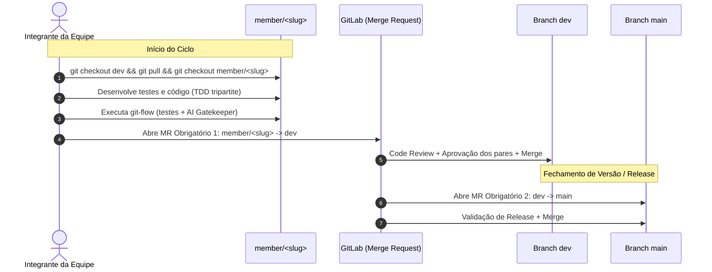

# Estratégia de Branches & Fluxo Obrigatório de Merge Requests

Este documento define a política oficial de branches, colaboração e controle de qualidade para o repositório **SI600 Web Petshop** (`si600-2026/turma-a/grupo-b/si600-web-petshop`).

---

## 1. Hierarquia de Branches

Branch | Finalidade | Política de Acesso
:--- | :--- | :---
**`main`** | Versão de produção / entrega final estável. Recebe exclusivamente código consolidado proveniente de `dev`. | **Protegida**. Pushes diretos proibidos. Modificação apenas via Merge Request aprovado.
**`dev`** | Branch de integração contínua e desenvolvimento ativo do grupo. Recebe as funcionalidades desenvolvidas pelos membros. | **Protegida**. Pushes diretos proibidos. Modificação apenas via Merge Request aprovado.
**`member/<slug>`** | Branch de trabalho individual de cada integrante da equipe, originada a partir de `dev`. | **Livre para o proprietário**. Pushes permitidos.

---

## 2. Mapeamento de Branches dos Integrantes

Com base na composição do Grupo B (Turma A):

| Integrante | RA / Usuário | Branch Dedicada |
| :--- | :--- | :--- |
| **Felipe Ferreira Moreira** | `@237124` | `member/felipe-moreira` |
| **Gabriel Matheus Pereira Dos Santos** | `@281416` | `member/gabriel-santos` |
| **João Pedro Leite Calsavara** | `@197837` | `member/joao-calsavara` |
| **Julyo Elias Hidalgo Da Silva** | `@185720` | `member/julyo-silva` |
| **Lorenzo De Oliveira Pugina** | `@234073` | `member/lorenzo-pugina` |
| **Samuel Calegnan dos Santos Souza** | `@240432` | `member/samuel-souza` |
| **Samuel Lima Martins** | `@173820` | `member/samuel-martins` |

---

## 3. Fluxo de Trabalho Obrigatório



### Regras Mandatórias de Merge Request

1. **Regra de 2 Aprovações Obrigatórias (`Approvals Required = 2`)**:
   - Todo Merge Request para `dev` ou para `main` **exige no mínimo 2 aprovações formais** de integrantes da equipe antes de habilitar o botão de merge.
   - O autor do MR não pode aprovar a própria entrega (*Prevent approval by author*).
   - Commits subsequentes invalidam aprovações prévias, exigindo nova revisão.
2. **MR Obrigatório de Funcionalidade (`member/<slug>` $\rightarrow$ `dev`)**:
   - Todo trabalho desenvolvido em branch individual deve ser submetido à `dev` via Merge Request.
   - Pré-requisitos para merge:
     - 100% dos testes de integração passando (ADR 0001 e ADR 0002).
     - Veredito `APPROVED` pelo AI Gatekeeper (`ai-gatekeeper-reviewer`).
     - **No mínimo 2 aprovações de code review** de outros integrantes do grupo.
3. **MR Obrigatório de Release (`dev` $\rightarrow$ `main`)**:
   - A promoção de alterações para a branch `main` só ocorre por meio de Merge Request aberto a partir de `dev`.
   - Representa entregas de marcos acadêmicos ou releases formais estáveis.
   - **Exige no mínimo 2 aprovações** e validação completa de todos os gates.
4. **Pushes Diretos Proibidos**:
   - Ninguém pode realizar `git push origin dev` ou `git push origin main` diretamente.

### Configuração no GitLab (`gitlab.unicamp.br`):
1. Acesse o projeto no GitLab $\rightarrow$ **Settings** $\rightarrow$ **Merge requests**.
2. Na seção **Merge request approvals**:
   - Em *Approval rules*, configure a regra com **Approvals required = 2**.
   - Marque a opção: **Prevent approval by author**.
   - Marque a opção: **Prevent approvals by users who add commits**.
   - Marque a opção: **Remove all approvals when new commits are added**.

---

## 4. Comandos de Referência (`git` e `glab`)

### Sincronizar e trabalhar na sua branch:
```bash
# Atualizar a branch de integração
git checkout dev
git pull origin dev

# Atualizar sua branch com as novidades de dev
git checkout member/<seu-slug>
git merge dev
```

### Validar antes de abrir MR (Gatekeeper Local):
```bash
# Executar o pipeline git-flow pré-MR
bash .agents/skills/ai-gatekeeper-reviewer/scripts/run_review.sh --target .
```

### Abrir o MR para `dev`:
```bash
glab mr create \
  --source member/<seu-slug> \
  --target dev \
  --title "feat(<modulo>): <resumo da entrega>" \
  --description "Implementação baseada na RFC docs/rfc/rfc-<NN>-<slug>.md"
```

### Abrir o MR de release para `main`:
```bash
glab mr create \
  --source dev \
  --target main \
  --title "release: Consolidação de entrega da sprint/etapa" \
  --description "Merge da branch dev para main contendo as funcionalidades validadas."
```
