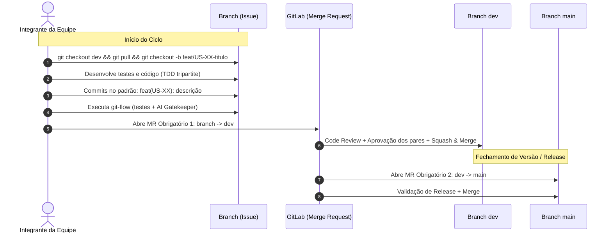

# Estratégia de Branches, Commits & Fluxo Obrigatório de Merge Requests

Este documento define a política oficial de branches, commits, colaboração e controle de qualidade para o repositório **SI600 Web Petshop**.

---

## 1. Hierarquia e Padrão de Branches

Branch | Finalidade | Política de Acesso
:--- | :--- | :---
**`main`** | Versão de produção / entrega final estável. Recebe exclusivamente código consolidado proveniente de `dev`. | **Protegida**. Pushes diretos proibidos. Modificação apenas via MR.
**`dev`** | Branch de integração contínua e desenvolvimento ativo do grupo. | **Protegida**. Pushes diretos proibidos. Modificação apenas via MR.
**`<tipo>/<ID-da-issue>-<titulo>`** | Branch de trabalho associada a uma issue, originada a partir de `dev`. | **Livre**. Pushes permitidos.

### Padrão de Nomenclatura das Branches

Toda branch de desenvolvimento deve seguir estritamente o formato: `<tipo>/<ID-da-issue>-<titulo ou resumo>`.

**Tipos permitidos**:
- `feat`: Histórias novas ou funcionalidades.
- `fix`: Correção de bugs.
- `docs`: ADRs, planos de teste, documentação.
- `chore`: Configuração, ambiente, tarefas sem valor direto para o usuário.

**Regras**:
1. Sempre criar a branch a partir da branch principal (`dev`) atualizada.
2. Um ID de issue por branch. Se a história for grande, quebrem em sub-tarefas na própria issue, mas mantenham a mesma branch ou criem novas associadas às sub-issues.
3. Resumo em minúsculas, sem acento, palavras separadas por hífen.

**Exemplos**:
- `feat/US-04-envio-pdf-estande`
- `feat/US-08-geracao-pagamento`
- `docs/ADR-004-regras-calculo-taxas`
- `chore/EC-01-setup-ambiente`
- `fix/US-06-quantidade-negativa`

---

## 2. Padrão de Commits

O padrão de commits é baseado no Conventional Commits, adaptado com a inclusão obrigatória do ID da issue para rastreabilidade no board do GitLab.

**Formato do Commit**:
`<tipo>(<ID-da-issue>): <descrição curta no imperativo>`

**Tipos permitidos no commit**:
- `feat`: funcionalidade nova
- `fix`: correção
- `docs`: documentação/ADR
- `test`: testes
- `refactor`: refatoração sem mudar comportamento
- `chore`: configuração, dependências

**Regras**:
1. Um commit deve representar uma mudança coerente. Evitem commits gigantes misturando várias tarefas diferentes.
2. Descrição sempre no **imperativo** (ex.: "implementa", não "implementado" ou "implementei").

**Exemplos**:
- `feat(US-04): implementa upload do PDF do estande`
- `fix(US-06): impede quantidade negativa na taxa variável`
- `docs(ADR-004): registra regras de cálculo das taxas`
- `test(QA-02): adiciona casos de teste do fluxo de aprovação`
- `chore(TEC-01): configura docker-compose com PostgreSQL`

---

## 3. Fluxo de Trabalho Obrigatório


```mermaid
sequenceDiagram
    autonumber
    actor Dev as Integrante da Equipe
    participant Branch as Branch (Issue)
    participant GitLabMR as GitLab (Merge Request)
    participant DevBranch as Branch dev
    participant MainBranch as Branch main

    Note over Dev,Branch: Início do Ciclo
    Dev->>Branch: git checkout dev && git pull && git checkout -b feat/US-XX-titulo
    Dev->>Branch: Desenvolve testes e código (TDD tripartite)
    Dev->>Branch: Commits no padrão: feat(US-XX): descrição
    Dev->>Branch: Executa git-flow (testes + AI Gatekeeper)
    Dev->>GitLabMR: Abre MR Obrigatório 1: branch -> dev
    GitLabMR->>DevBranch: Code Review + Aprovação dos pares + Squash & Merge
    
    Note over DevBranch,MainBranch: Fechamento de Versão / Release
    GitLabMR->>MainBranch: Abre MR Obrigatório 2: dev -> main
    GitLabMR->>MainBranch: Validação de Release + Merge
```

### Regras Mandatórias de Merge Request

1. **Título e Descrição**:
   - Título do MR deve ser igual ao commit principal, ex.: `feat(US-08): geração de pagamento por taxa`.
   - Descrição: Deve detalhar o que foi feito, como testar (ligando com a issue de QA, se existir) e incluir o link da issue de desenvolvimento.

2. **Regra de Aprovação Obrigatória (`Approvals Required = 1`)**:
   - Todo MR exige no mínimo 1 aprovação formal de outro integrante antes do merge.
   - O autor do MR não pode aprovar a própria entrega.

3. **Squash and Merge**:
   - O merge para `dev` deve ser feito utilizando *Squash*, consolidando as mudanças em um único commit coerente. Isso mantém o histórico da branch principal limpo e legível. (Ver ADR correspondente).

4. **MR Obrigatório de Release (`dev` -> `main`)**:
   - A promoção para `main` ocorre por MR, consolidando uma release/sprint.

5. **Pushes Diretos Proibidos**:
   - Ninguém pode realizar `git push origin dev` ou `git push origin main` diretamente.

### Configuração no GitLab (`gitlab.unicamp.br`):
1. Acesse o projeto no GitLab -> **Settings** -> **Merge requests**.
2. Na seção **Merge request approvals**:
   - Em *Approval rules*, configure a regra com **Approvals required = 1**.
   - Marque a opção: **Prevent approval by author**.
   - Marque a opção: **Prevent approvals by users who add commits**.
   - Marque a opção: **Remove all approvals when new commits are added**.

---

## 4. Comandos de Referência (`git` e `glab`)

### Iniciar uma nova tarefa:
```bash
git checkout dev
git pull origin dev
git checkout -b <tipo>/<ID-da-issue>-<titulo>
```

### Validar antes de abrir MR:
```bash
bash .agents/skills/ai-gatekeeper-reviewer/scripts/run_review.sh --target .
```

### Abrir o MR para `dev`:
```bash
glab mr create \
  --source <nome-da-branch> \
  --target dev \
  --title "feat(<ID-da-issue>): <resumo da entrega>" \
  --description "Closes #<ID-da-issue>. <Instruções de teste / dependências>"
```

### Abrir o MR de release para `main`:
```bash
glab mr create \
  --source dev \
  --target main \
  --title "release: Consolidação de entrega da sprint/etapa" \
  --description "Merge da branch dev para main contendo as funcionalidades validadas."
```
