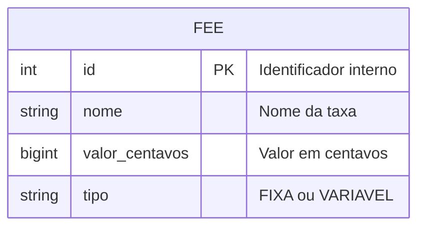

# RFC: US-02 - Catálogo de Taxas (Fee Catalog)

| **Status** | Implementado |
|---|---|
| **Data** | 06/10/2026 |
| **Versão** | 1.0 |

---

## Contextualização

### Entendendo o problema
A organização do evento possui diversas taxas aplicáveis aos aluguéis de estandes (ex: taxa de limpeza, taxa de energia extra, taxa por m²). Sem um catálogo estruturado, o sistema não conseguiria calcular automaticamente o valor final da pré-cotação, exigindo intervenção manual e aumentando a margem de erros.

### Explicando a solução de forma macro
A solução implementa um CRUD básico para o "Catálogo de Taxas" (Fee Catalog), permitindo cadastrar, listar e gerenciar as taxas que poderão ser aplicadas aos estandes. 

---

## Implementação

### Diretriz Obrigatória de Testes
> [!IMPORTANT]
> **Padrão do Projeto: Apenas Testes de Integração e E2E (Sem Mocks Unitários)**
> Conforme definido nas [ADR 0001](../adr/0001-estrategia-de-testes-integracao-e-e2e.md) e [ADR 0002](../adr/0002-padroes-de-cenarios-de-teste-bons-ruins-incompletos.md), todos os testes são de integração verificando a persistência no banco.

---

### Rotas Propostas

| Método | Caminho | O que faz | Entrada (campos relevantes) | Saídas (status e códigos RFC 7807) |
|---|---|---|---|---|
| `POST` | `/api/v1/fees` | Cria uma nova taxa | `nome`, `valor`, `tipo` | `201 Created`; `400 Bad Request` |
| `GET` | `/api/v1/fees` | Lista todas as taxas | Nenhuma | `200 OK` |

---

### Banco de Dados (Diagrama ER)

---

### Fluxos Detalhados Textuais (Cobertura Tripartite ADR 0002)

#### 1. Casos Bons (Happy Path)
1. Inserção de uma nova taxa com dados válidos retorna `201 Created` e salva no banco.
2. Consulta de taxas retorna lista preenchida.

#### 2. Casos Ruins (Sad Path / Regras de Negócio)
1. **Nome Duplicado**: Tentativa de cadastrar taxa com nome já existente retorna `409 Conflict`.

#### 3. Casos Incompletos (Boundary & Malformed Payloads)
1. **Campos Omitidos**: Payload sem `nome` ou `valor` retorna `400 Bad Request` via RFC 7807.
