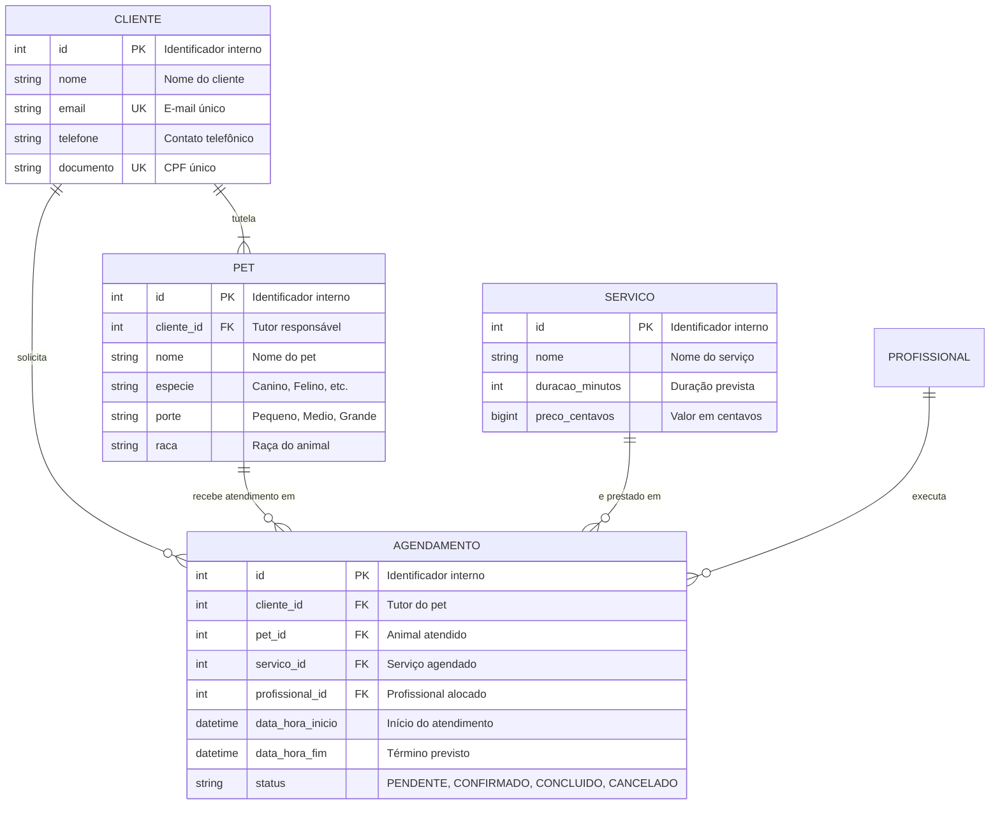
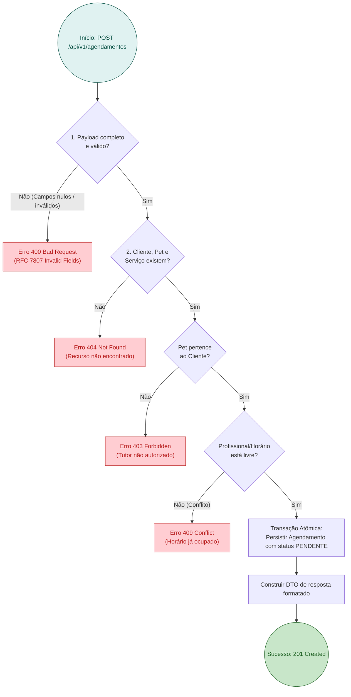

# Modelo Oficial de RFC (Template Base)

> [!NOTE]
> Este documento é o **template padrão** para criação de novas RFCs (*Request for Comments*) no projeto **SI600 Web Petshop**. Para criar uma nova RFC, copie este modelo para `docs/rfc/rfc-<NN>-<slug>.md` e preencha todas as seções obrigatórias.

---

# RFC — [Título da Funcionalidade / Arquitetura]

| | |
|---|---|
| **Status** | **[Proposta \| Em Refinamento \| Aprovada \| Substituída]** |
| **Time / Autor** | [Nome do Autor / Integrante(s)] |
| **Data** | [DD/MM/AAAA] |
| **Versão** | [Número da Versão, ex: 1.0] |

---

## Contextualização

### Entendendo o problema
[Explique em 1 ou 2 parágrafos a dor real do cliente (tutor do animal) ou do time interno (tosadores, veterinários, atendentes), o contexto operacional do pet shop e os riscos de uma modelagem ou comportamento inadequado.]

### Explicando a solução de forma macro
[Apresente a solução proposta em alto nível, destacando as principais entidades envolvidas, as regras de negócio e como a funcionalidade resolve a dor identificada.]

### Alternativas Descartadas e Trade-offs
[Liste no mínimo 3 alternativas técnicas ou de modelagem que foram consideradas e descartadas, explicando o motivo do descarte e em qual cenário cada uma seria viável.]
- *[Alternativa A]* — descartada porque... Seria vantajosa apenas se...
- *[Alternativa B]* — descartada porque... Seria vantajosa apenas se...
- *[Alternativa C]* — descartada porque... Seria vantajosa apenas se...

---

## Implementação

### Diretriz Obrigatória de Testes
> [!IMPORTANT]
> **Padrão do Projeto: Apenas Testes de Integração e E2E (Sem Mocks Unitários)**
> Conforme definido nas [ADR 0001](file:///home/jpcalsavara/projetos/andamento/si600-web-petshop/docs/adr/0001-estrategia-de-testes-integracao-e-e2e.md) e [ADR 0002](file:///home/jpcalsavara/projetos/andamento/si600-web-petshop/docs/adr/0002-padroes-de-cenarios-de-teste-bons-ruins-incompletos.md):
> - Toda funcionalidade deve ser testada exclusivamente nos seams públicos (endpoints HTTP reais contra o banco de dados de integração ou testes E2E no navegador). Mocks de banco ou de serviços internos são estritamente proibidos.
> - Toda suíte de testes deve cobrir a **Matriz Tripartite**:
>   1. **Casos Bons (Happy Path)**: fluxos válidos com persistência verificada e status HTTP 200/201.
>   2. **Casos Ruins (Sad Path / Regras de Negócio)**: violações de regra, horários conflitantes (409), tutor não proprietário do pet (403), recurso inexistente (404), garantindo zero escrita suja no banco.
>   3. **Casos Incompletos (Boundary & Malformed Payloads)**: campos faltantes, strings vazias, valores fora de faixa, tipos inválidos, garantindo resposta HTTP 400 com RFC 7807 e zero erro 500 não tratado.

---

### Rotas Propostas

| Método | Caminho | O que faz | Entrada (campos relevantes) | Saídas (status e códigos RFC 7807) |
|---|---|---|---|---|
| `POST` | `/api/v1/agendamentos` | Cria um novo agendamento para um pet | `clienteId`, `petId`, `servicoId`, `profissionalId`, `dataHoraInicio` | `201 Created`; `400 Bad Request` (payload incompleto); `404 Not Found` (pet/servico não existe); `409 Conflict` (horário já ocupado) |
| `GET` | `/api/v1/agendamentos/{id}` | Consulta detalhes do agendamento | `id` na URL | `200 OK` (DTO do agendamento formatado); `404 Not Found` |

---

### Banco de Dados (Diagrama ER)

---

### Desenho de Fluxo da Rota (As Seis Perguntas Obrigatórias)

> [!IMPORTANT]
> **Diagrama Base Obrigatório de Toda RFC**: Toda rota crítica deve possuir seu fluxo mapeado respondendo às 6 perguntas fundamentais:
> 1. Qual é o endpoint e método (`POST /...`)?
> 2. Quais são as validações e consultas realizadas no banco?
> 3. Quais são os desvios de erro e respectivos códigos HTTP (`400`, `403`, `404`, `409`, `422`)?
> 4. O que é criado/alterado no banco e qual o estado resultante?
> 5. Qual DTO de resposta estruturado é construído?
> 6. Qual o código HTTP de sucesso retornado (`200`, `201`)?

---

### Fluxos Detalhados Textuais (Cobertura Tripartite ADR 0002)

#### 1. Casos Bons (Happy Path)
1. Requisição com payload completo e válido chega ao endpoint.
2. Camada de serviço valida a integridade referencial (existência de Cliente, Pet, Serviço e disponibilidade de Profissional).
3. Transação atômica persiste o registro no banco com status `PENDENTE` ou `CONFIRMADO`.
4. Resposta com status `201 Created` e corpo no schema DTO especificado.

#### 2. Casos Ruins (Sad Path / Regras de Negócio)
1. **Recurso Inexistente**: Pet ou Serviço não encontrado responde `404 Not Found`.
2. **Pertença Violada**: Pet não vinculado ao Cliente solicitante responde `403 Forbidden`.
3. **Conflito de Horário**: Profissional ou vaga já ocupada no intervalo responde `409 Conflict`.
4. Em todos os casos ruins, nenhuma alteração de estado ou registro parcial é persistido no banco de dados.

#### 3. Casos Incompletos (Boundary & Malformed Payloads)
1. **Campos Obrigatórios Omitidos**: ausência de `petId`, `servicoId` ou `dataHoraInicio` responde `400 Bad Request` com lista detalhada de campos faltantes via RFC 7807.
2. **Tipos Inválidos**: string em campo numérico, data malformada ou no passado responde `400 Bad Request`.
3. **Strings Vazias / Whitespace**: responde `400 Bad Request` com mensagem informativa.

---

## Principal Desafio

- **Qual é:** [Descreva o principal desafio técnico de concorrência, consistência de dados ou integridade da regra.]
- **Por que é difícil:** [Explique as possíveis condições de corrida, contenção de locks ou impacto de falha.]
- **Como o desenho resolve:** [Apresente a estratégia adotada: locks transacionais, restrições UNIQUE de banco, validações atômicas.]
